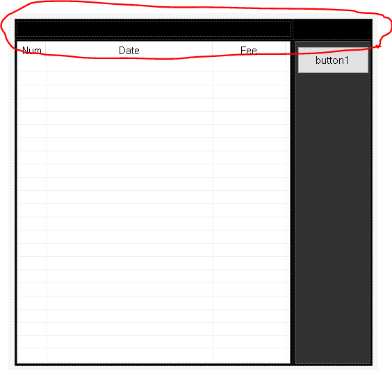

### **※ 상단바 색이 마음에 안들어서 Black으로 하려한다**



## 1. Form1 속성 탭에서

- FormBorderStyle → Sizable에서 None로 변경

## 2. TableLayoutPanel으로 상단바를 대신할 지역 구역 구분

## 3. 세개의 마우스 이벤트 추가

- MouseDown
  
    ```csharp
    /*눌렀을 때 움직이도록 하기 위한 bool 변수*/
    g_isMove = true;
    /*눌렀을 때의 위치를 저장하기 위한 Point 객체*/
    g_fPt = new Point(e.X, e.Y);
    ```
    
- MouseUp
  
    ```csharp
    /*떼었을 때 움직이지 않도록*/
    g_isMove = false;
    ```
    
- MouseMove
  
    ```csharp
    if(g_isMove && (e.Button & MouseButtons.Left) == MouseButtons.Left)
    {
    	Location = new Point(this.Left - (g_fPt.X - e.X), this.Top - (g_fPt.Y - e.Y));
    }
    ```
    

## 4. Close 버튼 추가

- 클릭 이벤트

  ```csharp
  this.Close();
  ```