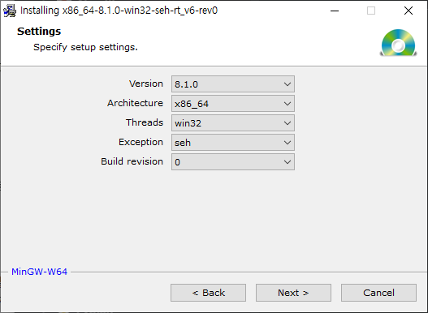

설치 위치 : [http://mingw-w64.org/doku.php](http://mingw-w64.org/doku.php)

## Architecture

- i686 : 32bits
- x86_64 : 64bits

## Threads

- posix
- win32

## Exception

- SEH : 훨씬 더 효율적이지만 호환성에 문제가 있는 것으로 보인다. SEH를 사용하지 않는 라이브러리를 사용할 때 문제가 있다. 이걸 대부분 쓰시네.
- SJLJ : 여러 아키텍처에서 광범위한 호환성을 보인다. SJLJ 예외는 C 라이브러리를 포함한 다른 예외 처리 시스템을 사용하는 라이브러리를 통해 발생할 수 있다. 하지만 성능이 저하된다.
- 코드에 관한 실제 차이점은 없고 전환도 쉽다. 걱정하지 마라.

## The file has been downloaded incorrectly! 에러 해결

- 참고
  
    The file has been downloaded incorrectly! 에러 해결
    
    → [https://m.blog.naver.com/kh2un/222037244807](https://m.blog.naver.com/kh2un/222037244807)
    
    환경 변수 편집
    
    → [https://blog.naver.com/dlgus0828/222199698928](https://blog.naver.com/dlgus0828/222199698928)
